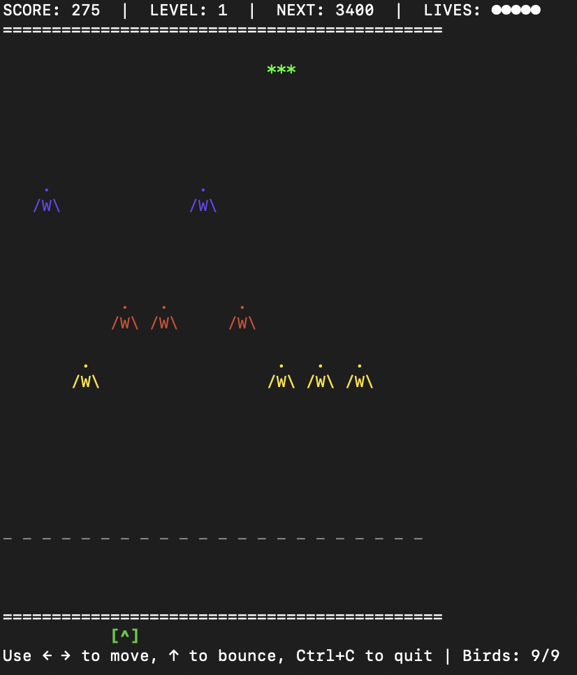
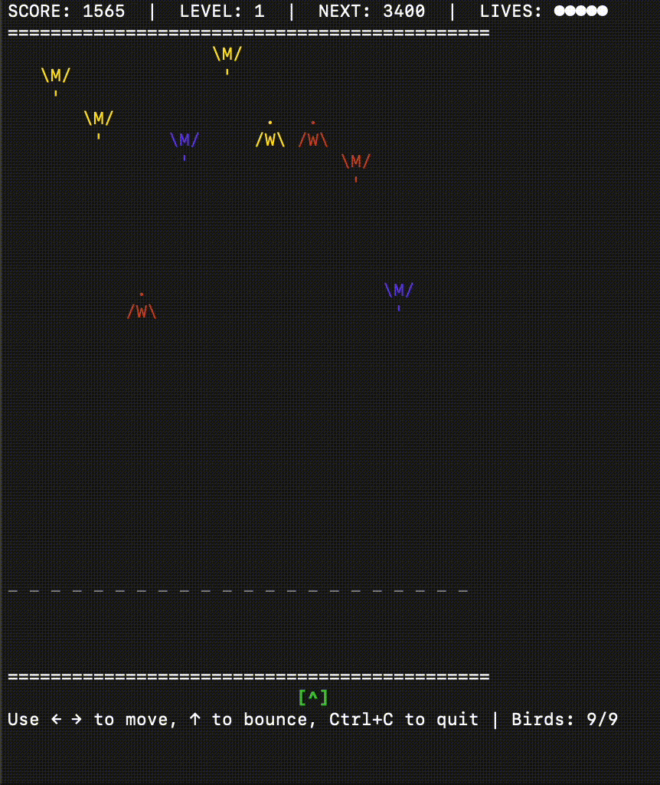

# BVB - Bird vs Bat Juggling Game

A roguelike arcade game where you juggle 9 colorful birds that bounce and battle against obstacles and bats!


# BVB — Bird vs Bat (terminal arcade)

Bird vs Bat (BVB) is a lightweight terminal arcade/roguelike where you juggle 9 birds, use per-bird powers,
manage lanes, and fight dynamically spawning bats and obstacles. This README documents how to play,
what changed recently, developer notes and configuration.

All content below is in English.

<!-- Project media: replace the files in media/ with your real assets -->




## Quick start

From source (recommended for development):

```bash
python3 start.py
```

Standalone binary (if present):
- macOS: `dist/BVB` (run `./dist/BVB`)
- Windows: `dist/BVB.exe`

## Controls

- ← / → : Move cursor between lanes
- ↑ : Bounce the bird in the selected lane (if already rising, activates that bird's power — once per ascent)
- ↓ : (unused) — the Suction power has been removed; new loot-based power-ups (Tailwind, Shuffle) now change flock behavior when collected
- SPACE : Swap mode (select a lane, press again to swap two birds). Swap costs points (200 × current level).
- Q or Ctrl+C : Quit

## What's new (high level)

- Added new bird types: STEALTH, PATCHWORK, GOLD and their eggs.
- `stealth_egg`: a new rare egg (rarity = "rare", weight = 10) that spawns a STEALTH bird when collected.
- STEALTH bird behaviour:
  - Normally invisible: rendering alternates between visible dark-gray and ANSI "conceal" (SGR 8) so it is
    hidden on supporting terminals.
  - Pass-through: while stealth (non-tangible) it passes through bats, obstacles and loot.
  - Power (press ↑ while rising): become tangible for a short window and deal heavy damage to nearby enemies.
  - Power also grants a short speed boost (speed = 6) for the power duration.
- PATCHWORK bird and `patchwork_egg` (uncommon): triggers all synergy effects of other birds.
- GOLD bird and `gold_egg` (rare): special scoring bird (higher passive score / fast speed).
- Blue sprint behaviour fixed: sprint now times out correctly and the bird returns to its normal color when the boost ends.
- Despawn: bats and loot older than 60 seconds are cleaned up automatically to avoid screen clutter.
- Firebase telemetry: total play time is now tracked and submitted with game-over events.
- Misc: audio/music backend removed for determinism in terminal builds.
 - Removed legacy power-ups: Bounce Boost and Suction. These were replaced with two new loot-based power-ups (Tailwind and Shuffle) to streamline gameplay and avoid input lag issues.
 - New power-up — Tailwind (symbol: ༄): a tiered pickup that temporarily boosts rising birds and penalizes falling birds. While active the starting line is visually highlighted and bird vertical speeds are clamped for balance.
 - New power-up — Shuffle (symbol: 𖦹): a tiered pickup that smartly swaps birds between lanes (2/4/6 birds depending on tier) to compact the formation toward the center. Moved birds are reset to the starting line and begin rising.

## Birds (summary)

Each bird has a base speed and a special power triggered while the bird is rising (↑ twice).

- Yellow (speed 2)
  - Power: slow adjacent falling birds for a short duration (except other yellows, which are bounced).

- Red (speed 3)
  - Power: fires a projectile upward. Projectile damage increases when adjacent red/patchwork birds are rising.

- Blue (speed 4)
  - Power: temporary speed boost and +1 damage. The bird is visually highlighted (CYAN) while boosted.
  - Sprint is limited-time and will stop either on bounce or when the boost duration expires.

- White (speed 4)
  - Power: affects multiple lanes (±2 lanes). Can bounce falling birds or trigger rising birds' powers.

- Purple (speed 3)
  - Knows no fear.

- Clockwork (speed 2)
  - Auto-bounce on floor (helps keep lanes active). Does not die on floor like other birds.

- PATCHWORK (speed 3)
  - Triggers synergy effects of all other colors.

- GOLD (speed 6)
  - High-scoring special bird. Scores larger passive points each frame when alive.

- STEALTH (speed 3 base)
  - Stealth behavior (see "Stealth mechanics" below).

## Stealth mechanics (detailed)

- Stealth birds alternate between visible DARK_GRAY and ANSI conceal (hidden) while flying.
- While in stealth (non-tangible) they pass through bats, obstacles and loot — they won't collide or collect.
- Activating the stealth power (↑ while rising) makes the bird tangible for a short duration (configurable in code):
  - During tangibility the bird deals heavy damage to nearby bats/obstacles and destroys nearby loot.
  - The bird's speed is temporarily set to 6 for the duration of the tangible window.
  - The bird displays a bright color (WHITE) while tangible so the player sees the power.
- The power is allowed only once per ascent (the internal `bird_power_used` flag prevents re-activation until the bird
  falls and then rises again).

## Loot system (brief)

- Loot drop logic takes the enemy tier and current empty lanes into account. Eggs are only dropped when there are
  empty lanes available (to avoid unreachable eggs).
- New egg: `stealth_egg` included in the "rare" egg pool with weight 10.

Rare egg composition now includes: blue_egg, clockwork_egg, purple_egg, gold_egg, stealth_egg (weights: 40, 20, 20, 10, 10).

When a `stealth_egg` is collected, it spawns a STEALTH bird in the first available (dead) bird slot.

New loot additions: Tailwind and Shuffle

- Tailwind (symbol: '༄'): a loot pickup that applies a tiered modifier to bird vertical speeds. Rising birds receive a temporary upward speed bonus while falling birds receive a penalty; speeds are clamped to remain balanced (game clamps to a safe range). The starting line receives a visual indicator while Tailwind is active.
- Shuffle (symbol: '𖦹'): a loot pickup that triggers an automatic lane reorganization. Depending on tier, it swaps a small group of birds (e.g. 2 / 4 / 6) and prefers compacting birds toward the center by moving outer birds into empty or inner lanes; birds moved by Shuffle are reset to the starting line and set to rise.

## Enemies & despawn

- Obstacles and bats spawn in tiers with increasing HP and difficulty.
- Entities older than 60 seconds are automatically removed from the world (both bats and loot) to reduce clutter.

## Achievements & telemetry

- Basic achievements are tracked and displayed as short notifications.
- If a Firebase client is configured, the game attempts to submit analytics events in the background.
- On game over the session's elapsed play time (seconds + formatted string) is included with the score submission.

## Developer notes

Run locally:

```bash
python3 start.py
```

Build a single-file executable with PyInstaller:

```bash
pip install pyinstaller
pyinstaller --onefile --name BVB --console start.py
```

Configuration & tuning

- Many gameplay timings are derived from `base_sleep` at the top of `start.py`.
  - `base_sleep` controls the global frame speed; durations are converted to frame counts using `int(seconds/base_sleep)`.
- To tune power durations, search for values like `int(2.0 / base_sleep)` or `int(5.0 / base_sleep)` in `start.py`.
- Stealth tangible window and speed boost are applied near the code path where `stealth_timers[...]` is set.

Terminal compatibility notes

- The stealth effect uses ANSI SGR 8 (conceal) to hide the sprite on terminals that support it. Not all terminals honor
  SGR 8; on terminals that ignore it the invisibility will be a no-op and the bird will still appear. If you see no
  invisibility, the bird will still behave correctly (pass-through mechanics are logic-based).

Debugging tips

- Enable on-screen notifications (they are used for achievements and some debug messages). They appear in the footer.
- If a power doesn't look like it activated, check whether `bird_power_used` is True for that bird (logic prevents multiple
  activations per ascent).

Contributing

- Open a PR with focused changes. Prefer minimal, isolated diffs. If changing tune constants, include the rationale and
  observable impact (e.g. "increased blue sprint to 8s for better feel").

License & credits

- This project is provided as-is. See repository for license information and credits.

Enjoy and let me know if you want any of these behaviours tuned or documented further.
 
---

## Visual highlights & quick reference ✨

Below are compact, printable references that are easy to scan while playing.

### Birds at a glance

| Bird | Speed | Power (while rising) | Notes |
|---:|:---:|:---|:---|
| 📣 Yellow | 2 | Slow adjacent falling birds (except yellows) | Bounce other yellows instead of slowing |
| 🔥 Red | 3 | Fire projectile (damage bonus with adjacent rising red/patchwork) | Great vs bats/obstacles |
| ✈️ Blue | 4 | Temporary speed + damage (+1) — visual: CYAN | Sprint ends on bounce or timeout |
| 💪🏻 White | 4 | Multi-lane effect (±2 lanes) — bounce or trigger adjacent powers | Utility / crowd control |
| 🦸🏻‍♂️ Purple | 3 | Special obstacle/bat interactions | Lane-control specialist |
| 🤖 Clockwork | 2 | Auto-bounce on floor/ceiling | Stable lane maintainer (survivor) |
| ✂️ Patchwork | 3 | Visual multicolor (counts as other colors for synergy) | Decorative + synergy |
| 🥇 Gold | 6 | High passive score | Fast and valuable |
| 🕶️ Stealth | 3 (base) | Become tangible briefly — heavy damage, speed=6 while active | Invisible while stealth; pass-through mechanics |

---

### Power-ups (loot) at a glance

- ༄  Tailwind — Tiered pickup that boosts rising birds and penalizes falling birds. Visual starting-line indicator while active. Speeds are clamped for balance.
- 𖦹  Shuffle — Tiered pickup that performs smart lane swaps (2/4/6 birds depending on tier) to compact the formation toward center; moved birds reset to the starting line and begin rising.


### Loot rarity bar chart (approximate weights)

```
Rare/Epic egg weights (visual):
common   ██████████████████████████████████  ~60
uncommon ████████████████  ~25-35
rare     ██████████  ~10-20  
epic     ████  ~5-15
```

Below is a tiny ASCII breakdown for *rare* egg choices (weights):

```
blue_egg     : ██████████████████████████ (40)
clockwork_egg     : ██████████ (20)
purple_egg   : ██████████ (20)
gold_egg     : ████ (10)
stealth_egg  : ████ (10)
```

---

## Formatting & color notes

- This README uses emoji, **bold**, *italic* and tables for clarity.
- Terminal color samples are shown in `start.py` as ANSI escapes; not all terminals honor every SGR code (notably SGR 8 "conceal").

If you want more visual polish (SVG charts, images, or GitHub action-generated badges), tell me which graphs you prefer and I can add them.

---

## Full content (reference & details)

> The rest of the README documents gameplay, developer notes and tuning pointers in plain English so you can
> tune and run the game easily. See the source `start.py` for implementation specifics (timings derived from `base_sleep`).

(See the file header in `start.py` for constants and exact code pointers.)
